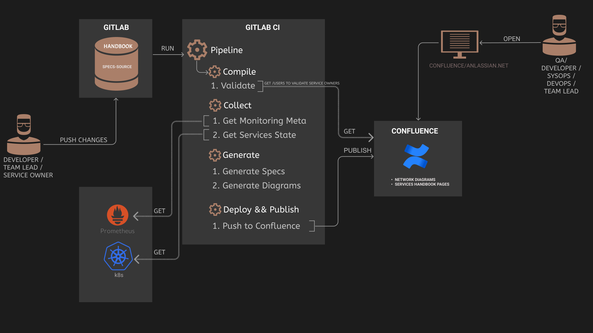

# arch-specs
## Overview
`arch-specs` is a set of tools for building architectural specifications 
and diagrams from structured information about your services to publish them to Confluence.


`arch-specs` consists of the following applications:
* __monitoring_collector__ - collects meta information (e.g. topic consumers/producers) from prometheus.
* __diagrams_generator__ - generates draw.io diagrams in `.xml` format.
* __specs_generator__ - generates specifications in `.json` format.
* __confluence_publisher__ - publishes arch. specifications and diagrams to Confluence.


`arch-specs` tools were added to gitlab-ci pipeline to publish new changes of specifications 
from master/release branches. 
`arch-specs` tools are executed in the next `pipeline stages`:
1. __validate__ - executes __specs_generator__ in validation mode to verify the contents of the files `meta/specifications/*.yaml`.
   Also this stage executes __confluence_publisher__ in validation mode to verify owner`s names. 
1. __build__ - merges `<product>/specifications/*.yaml` with meta information from PRO prometheus and
   generates draw.io diagrams in `.xml` format and specifications in `.json` format. 
1. __publish__ - updates draw.io diagrams and specifications on 'Services Handbook/*' Confluence Pages.

## Up-To-Date Support Policy
You can find on the [/docs/up_to_date.md](/docs/up_to_date.md) page 
a list of the events and your actions, which you should make upon the occurrence of each of them
to support arch documentation in up-to-date state.

## Execute stages locally
You can execute pipeline stages locally using `pipeline.sh` utility which you can find in `<repo_dir>/` folder. 
### Requirements
* Install Docker `>= v19.03.10`:
 https://docs.docker.com/engine/install/

* Install Docker Compose `>= v1.25.5`:
 https://docs.docker.com/compose/install/  

* Post-installation steps:
 https://docs.docker.com/engine/install/linux-postinstall/

* Python `>= v3.8.2`  _# only for the `collect` stage_

### Prerequisites
### Stage: validate
`validate` stage executes `specs_generator` application with a flag `--validate`. This mode allows run 
validation tests which verifies that the contents of the files `<product>/specifications/*.yaml` are correct:

```bash
bash pipeline.sh validate
```
If you want to validate  also owner`s names in Confluence you should execute stage `validate_full`:
```bash
bash pipeline.sh validate_full
```
> :information_source: __Note! if you want to use `validate_full` stage you should set auth_token( or user/password) in ENV vars to 
> `confluence_publisher`can authenticate to Confluence. More details in section: [stage-confluence](#stage-confluence)

### Stages: specs diagrams
On this stage the `pipeline` utility generates json specifications and draw.io diagrams. 
To execute stages you should make the next commands:
```bash
bash pipeline.sh build specs diagrams 
```

### Stage: confluence
> :warning: __Note! This stage modifies pages in your Confluence!
 Please, be careful when using it!

On this stage the `pipeline` utility update content of Confluence Pages from `Services Handbook/*` section. 
For the  `pipeline` utility to successfully authenticate in Confluence 
you need to set access token in the environment variable `confluence_publish_token`:
```bash
echo "
confluence_publish_token=<access_token>
">> .env
```
If you don`t have an access token to execute CRUD operation in Confluence you can set your user/password
instead of the access token:
```bash
echo "
confluence_auth_user=<rc_user>
confluence_auth_password=<rc_password>
">> .env
```

Then you should make the next commands to execute `confluence` stage:
```bash
bash pipeline.sh build confluence
```

### All Pipeline Stages
You can combine stages of  the `pipeline` utility to build stages pipeline. 
E.g. if you want to execute all stages sequentially you should 
run the next command:
```bash
bash pipeline.sh build specs diagrams confluence
```
or you can use command 'all' to execute all pipeline stages:
```bash
bash pipeline.sh all
```
